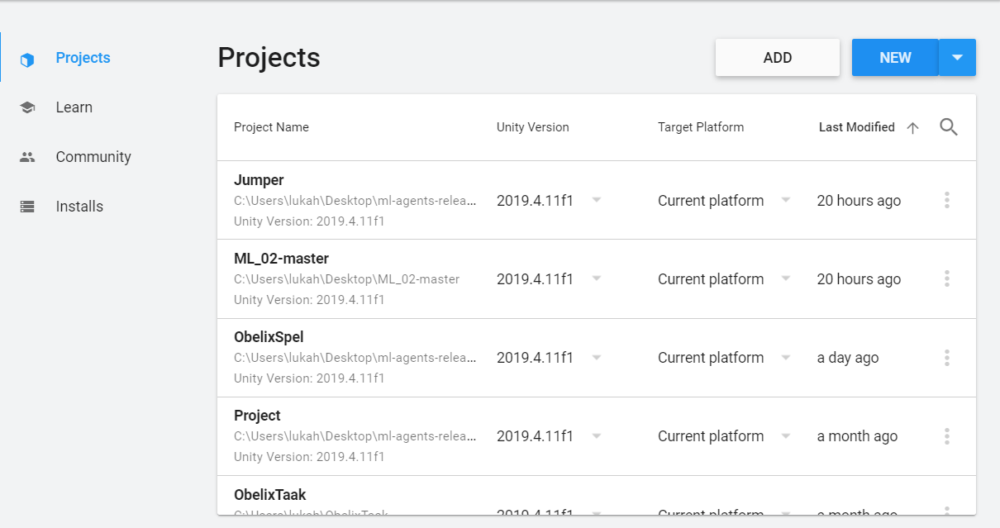
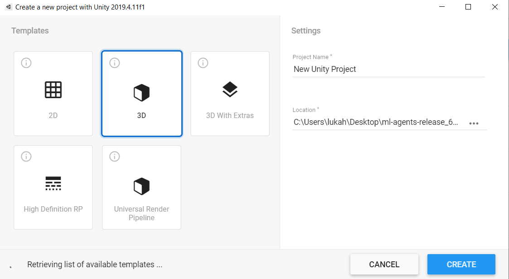
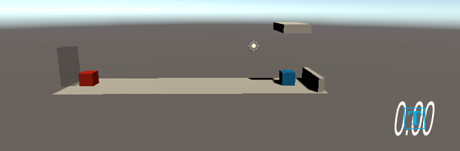
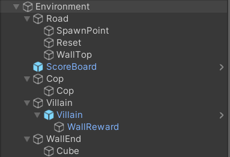
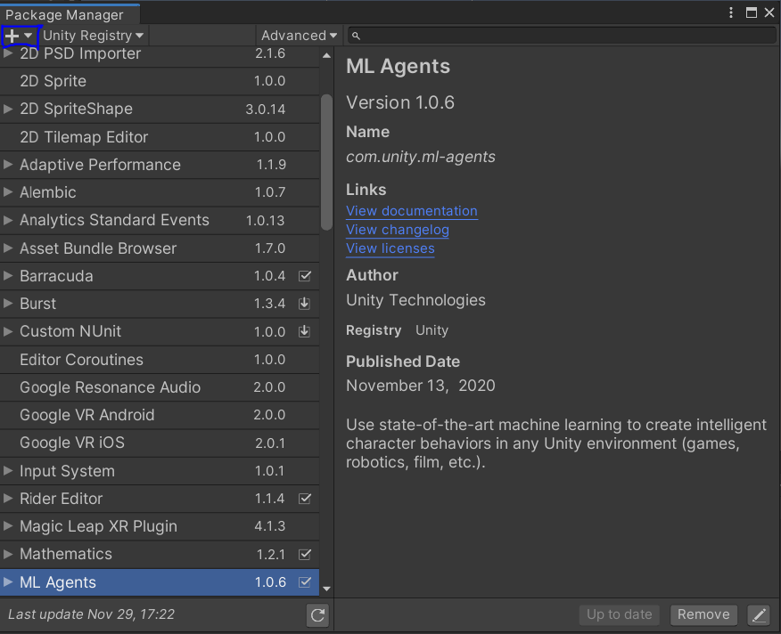
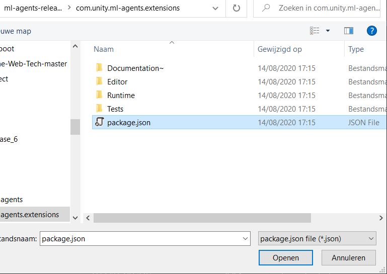

# Jumper Exercise Tutorial
## Inhoud
1. Inhoud
2. Inleiding
3. Benodigdheden
4. Unity Omgeving
5. Import ML-Agents
6. Componenten & Scripts

## Inleiding

Wij zijn 2 studenten van de AP Hogeschool en hebben een Unity project gemaakt waarbij een AI geleerd heeft over naderende obstakels te springen. 

| Student   |      email      |
|----------|:-------------:|
| Jonathan De Baerdemaeker |  s108835@ap.be |
| Luka Hendrickx |    s109055@ap.be   |

## Benodigdheden

1. Unity Hub 2.4.1 (https://unity3d.com/get-unity/download)
2. Unity versie 2019.4.11f1 (https://unity3d.com/unity/whats-new/2019.4.11)
3. ML-agents release 6 package (https://github.com/Unity-Technologies/ml-agents)
4. Visual Studio Community  (https://visualstudio.microsoft.com/downloads/)
5. Python 3.8.6 (https://www.python.org/downloads/)

## Unity Omgeving

### Project

We starten met het aanmaken van een nieuw Unity project met de Unity Hub die we geinstaleerd hebben. Je drukt op nieuw en selecteerd een 3D Project met een gepaste naam. Ten Slotte klik je op Create.
 

### Objecten

Maak nu de volgende Objecten aan in Unity zoals geillustreed op onderstaande afbeelding.

| Name   |      Soort Object      | Tag | 
|----------|:-------------:|:-------------:|
| Environment |  EmptyObject | environment |
| Cop |  3D GameObject Cube (Blue) | cop |
| Villain |    3D GameObject Cube (Red)  | villian |
| WallReward |    3D GameObject Cube (Transparent)  | wallreward |
| Road |    3D GameObject Panel  | road|
| WallTop |    3D GameObject Cube  | walltop |
| WallEnd |    3D GameObject Cube  | wallend |
| ScoreBoard |  3D GameObject TextMeshPro  | scoreboard |
| Spawnpoint |  EmptyObject | spawnpoint |
| Reset |  EmptyObject | reset |

De __Environment__ bezit alle Objecten om het later makkelijker te maken deze omgeving te dupliceren. Duplicering zal later het trainen van onze AI versnellen.

De __Spawnpoint__ bevindt zich in het Object __Villain__ zodat we later een script kunnen generen die meerdere __Villain__ Objecten op onze AI __Cop__ afstuurt.

De __Reset__ bevindt zich in ons __Cop__ Object om onze AI netjes terug op zijn plek te zetten als hij botst met de __Villain__ of het __WallTop__ Object.

De __WallReward__ is gestructureerd in de __Villain__ zelf en dient om onze __Cop__ te belonen. 

De __WallEnd__ dient om het __Villain__ Object te vernietigen als hij hier tegen botst.

## Import ML-Agents

In Unity klik je bovenaan op Window => Package Manager

Hier klik je op '+' zoals hierboven geselecteerd en kies je voor 'Add package from disk'

Selecteer de 'package.json' te vinden in je geinstalleerde folder van ML-Agents release 6. 

Hierna heb je succesvol ML-agents geimport in je project en kan je vervolgens bij andere projecten terug naar de PackageManager gaan om ML-agents opnieuw te importen.

## Componenten & Scripts

Voeg volgende Componenten of Scripts toe aan de bijstaande objecten van onze omgeving. Compontent kan je zelf toevoegen door rechts onderaan 'Add Component' te klikken. Scripts zal je zelf moeten generen door simpel weg rechtermuisknop 'Generate C# Script'.

| Object   |      Component      | Script | 
|----------|:-------------:|:-------------:|
| Environment |  / | Environment |
| Road |  / | Spawner |
| Cop |  Ray Perception Sensor 3D & Behaviour Parameters & RigidBody & Decision Requester  | Cop |
| Villain |  RigidBody  | Villain |

